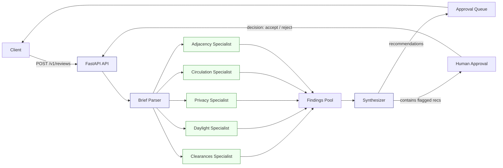

# rkitect Review Agent

Agentic architectural review API. Ingest a design brief, parse it deterministically, run five domain specialist checks, and synthesize actionable recommendations with a human-approval gate.

## Features

- `POST /v1/reviews` - full pipeline: brief parse → 5 specialists → synthesizer → persisted `ReviewResponse`
- `GET /v1/reviews/{run_id}` - retrieve a completed review
- `POST /v1/reviews/{run_id}/decisions` - accept or reject a recommendation
- `GET /health` - liveness check
- Deterministic rule-based parsing (no external LLM/API dependency)
- High-severity findings automatically gated for human approval

## Local Setup

Requires Python 3.10+.

```powershell
# create and activate a virtual environment
python -m venv .venv
.\.venv\Scripts\Activate.ps1

# install dependencies
python -m pip install fastapi uvicorn

# install test dependencies
python -m pip install pytest httpx httpx2

# run the test suite
python -m pytest tests/ -v
```

## Run the API

```powershell
uvicorn app.main:app --reload
```

Swagger UI: http://127.0.0.1:8000/docs

## Ready-to-Run Request

Create a review with the standard test brief (92 sq m, 8-seat dining table):

```bash
curl -X POST http://127.0.0.1:8000/v1/reviews \
  -H "Content-Type: application/json" \
  -d "{\"brief\": \"2 bedroom apartment, 92 sq m. Bedroom 1, Bedroom 2 / Study, Kitchen, Living room. Need to work from home and host parents. Prefer open feel, visual connection, and privacy. 8-seat dining table wanted. Maximize storage while keeping wide circulation.\"}"
```

## Architecture

